# Hi, I'm Kheshwen

Computer Science student at Universiti Teknologi PETRONAS, with an interest in cybersecurity and machine learning. I'm currently preparing for an internship starting January 2027.

## About Me

I'm a second-year Computer Science student in Malaysia with a growing interest in cybersecurity, machine learning, and practical software development.   
I enjoy learning by building from experimenting with security tools to developing applications and exploring how machine learning can be applied to real-world problems.   
Currently, I'm focused on strengthening my technical foundation and building projects that demonstrate what I can actually do.   

## Skills

**Programming & Web:** C++ · C# · Python · HTML · CSS · JavaScript  
**Cybersecurity:** Wireshark · Nmap · Burp Suite · Metasploit · Kali Linux  
**Machine Learning & Data:** TensorFlow · scikit-learn · PyTorch · Pandas · NumPy · MATLAB

## Currently Learning

- Deepening cybersecurity and ML skills ahead of my internship
- Developing stronger machine learning skills
- Building more practical Python projects

## GitHub Stats

## Contact

- Email: khesh555@gmail.com
- LinkedIn: [linkedin.com/in/kheshwenda](https://linkedin.com/in/kheshwenda)
